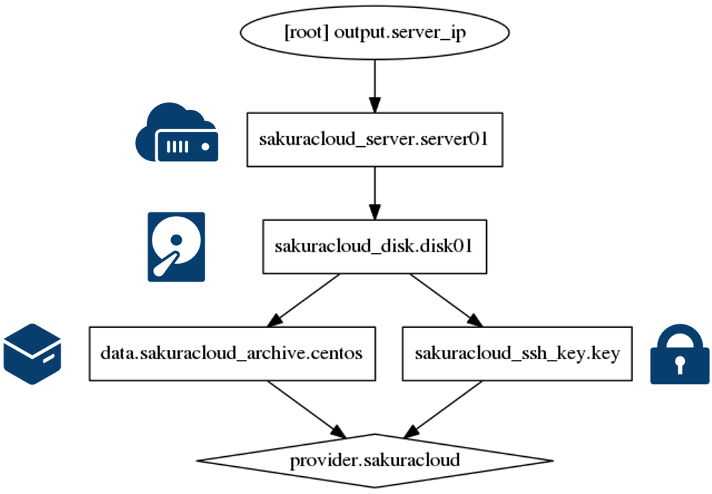

# 1. サーバを1台起動

最もシンプルな構成です。サーバを起動するために、ディスクを用意します。



## コマンド

* `terraform plan` … 確認
* `terraform apply` … 反映
* `terraform show` … 詳細情報の表示
* `terraform output` … IP アドレスの表示
* `terraform destroy` … 環境の破棄
```
$ terraform destroy
Do you really want to destroy?
  Terraform will delete all your managed infrastructure.
  There is no undo. Only 'yes' will be accepted to confirm.

  Enter a value: yes	←入力

data.sakuracloud_archive.centos: Refreshing state...
(snip)
Destroy complete! Resources: 3 destroyed.
```


## マップ機能で確認


