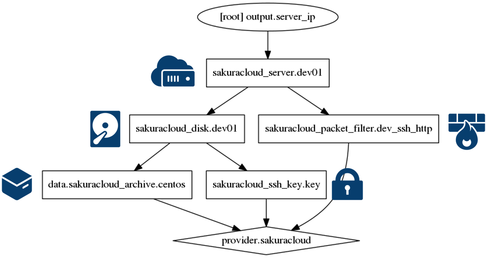
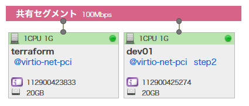

# 2. 開発用サーバを1台起動

典型的な開発環境を準備します。

* `Apache` を自動セットアップ
* `firewall-cmd` でポート `80` の公開を追加
* 「パケットフィルタ」機能に `icmp`、`ssh`、`http` ルールを作成



## コマンド

* `terraform plan` … 確認
* `terraform apply` … 反映
* `terraform show` … 詳細情報の表示
* `terraform output` … IP アドレスの表示
* `terraform destroy` … 環境の破棄
```


## マップ機能で確認



