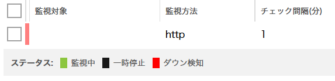
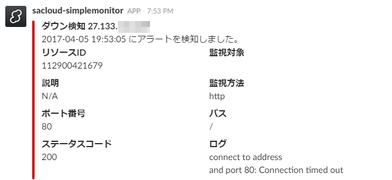

# 3. シンプル監視

シンプル監視機能を使い、`terraform` 用サーバを監視します。設定により、メールまたは Slack （Incoming Webhook ）の通知連携も可能です。


## 事前準備

サーバ `terraform` の IP アドレスを確認します。 `.tf` ファイルを開き、3行目の `<IP_ADDRESS_HERE>` を書き換えます。

```
    target = "<IP_ADDRESS_HERE>"
```

## コマンド

* `terraform plan` … 確認
* `terraform apply` … 反映
* `terraform show` … 詳細情報の表示
* `terraform output` … IP アドレスの表示
* `terraform destroy` … 環境の破棄

## シンプル監視を確認



## Slack通知例

`.tf` ファイルの slack 通知のコメントを削除します。また、`<TOKEN>` は通知先の Incoming Webhook をご確認ください。

```
    notify_slack_enabled = true
    notify_slack_webhook = "https://hooks.slack.com/services/<TOKEN>"
```




## 応用

* Terraform の `.tf` ファイルに追記すると、サーバ作成と同時に、自動的に監視を有効化できます。


## リファレンス

* シンプル監視 | さくらのクラウドニュース
  * http://cloud-news.sakura.ad.jp/simplemonitor/

