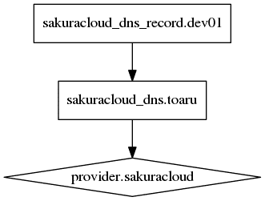

# 4. DNS（紹介のみ）

ドメインの追加や、追加済みドメインに対するレコードの操作が可能です。



## 事前準備

新しくドメインを登録する場合は、次のような `sakuracloud_dns` リソースを設定します（例：`toaru.org`）。

```
resource "sakuracloud_dns" "toaru" {
    zone = "toaru.org"
}
```

既にさくらのクラウドの DNS で登録済みの場合、対象となるドメイン名のリソース ID を調べます。そして、 `dns_id` 行をコメントアウトし、以下のように `dns_id` の `<ID_HERE>` にリソース ID を書きます。

```
resource "sakuracloud_dns_record" "dev01" {
    #dns_id = "${sakuracloud_dns.toaru.id}"
    dns_id = "<ID_HERE>"
    name = "dev01"
    type = "A"
    value = "192.168.0.1"
}

```


## 応用

* Terraform の `.tf` ファイルに追記すると、サーバ作成と同時に、ホスト名の割り当ても有効化できます。


