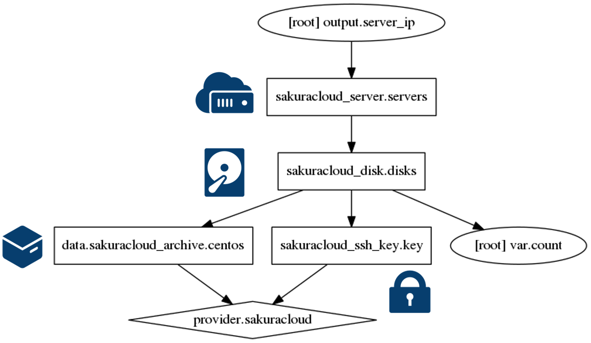
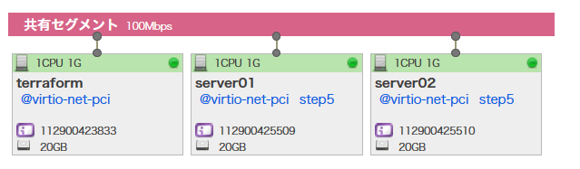
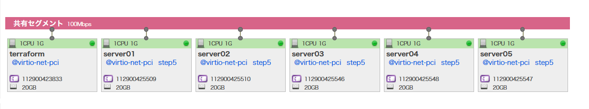
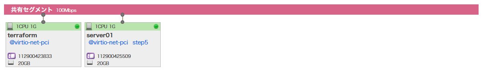

# 5. サーバのスケールアップ・ダウン

指定した数のサーバに自動的にスケールアップ・ダウンできる仕組みです。変数 `count` で指定した台数のサーバ（とディスク）を作成します。



Failed to load Terraform configuration or plan: open apply: no such file or directory

## コマンド

* `terraform plan` … 確認
* `terraform apply` … 反映
* `terraform output` … IP アドレスの表示

## マップ機能で確認



## サーバ台数を5台にする

`.tf` ファイルを開き、`count` の値を `5` にする。
```
variable "count" {
        default = "5"
}
```
その後、`plan` と `apply` を実行
```
terraform plan
terraform apply
```

再度マップの確認



再び `count` を `1` にすると、1台にスケールダウンもできます。



また、この値は、terraform のコマンドラインのオプションや、環境変数としても指定できます。


## tip：`count` のインデックス値はゼロから

`count` は `0` からカウントされます。そのため、表示上のサーバ名は人間が分かりやすくするため、`format` を使い整形しています（二桁の整数、かつインデックス値 + 1）

```
    count = "${var.count}"
    name = "${format("server%02d", count.index + 1)}"
````


