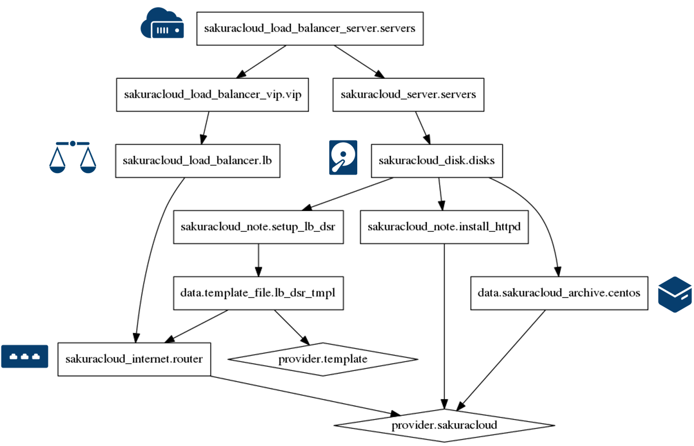
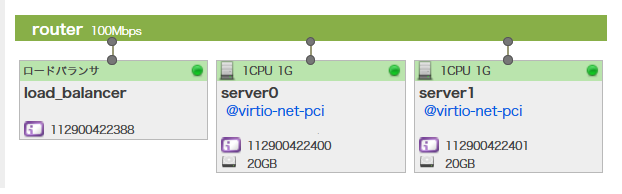

# 7. ロードバランサ

ロードバランサ・アプライアンスを使って負荷分散の構成を作成します。
詳細は [Terraform for さくらのクラウド スタートガイド（第四回）](http://knowledge.sakura.ad.jp/knowledge/8248/) をご覧ください。また、ロードバランサの詳細については[こちら](http://cloud-news.sakura.ad.jp/load-balancer/)をご覧ください。



## コマンド

* `terraform plan` … 確認
* `terraform apply` … 反映

## マップ機能で確認




## VIP にアクセス

VIP の情報を確認するには、コントロールパネルにアクセスするか、次のコマンドを実行します。

```
$ terraform show | grep vars.vip
  vars.vip = <IPアドレスが表示>
```

VIP を `curl` やブラウザで表示すると、2台のサーバの情報（`server0` または `server1`）を表示します（最小セッション方式のため、再読みしても同じホスト名が出る場合があります）。


## リファレンス

* ロードバランサ | さくらのクラウドニュース
  * http://cloud-news.sakura.ad.jp/load-balancer/
